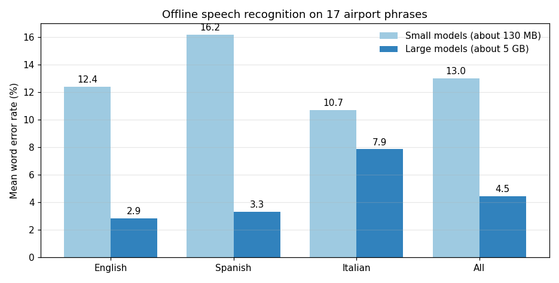
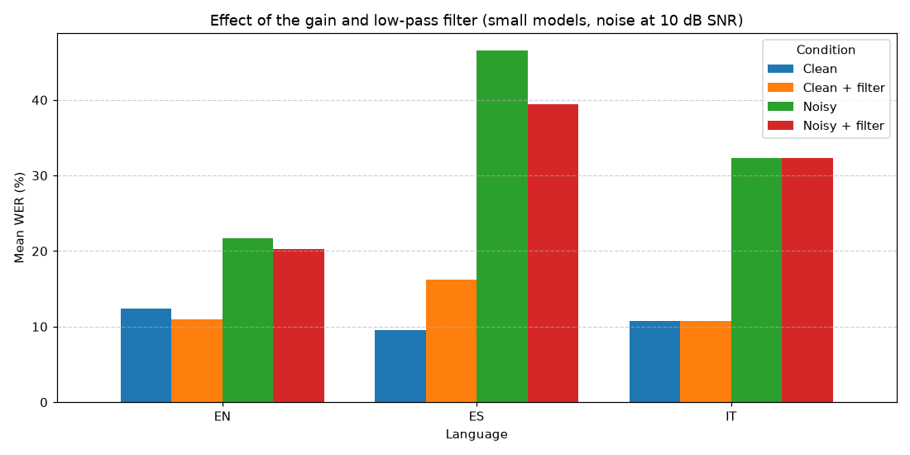

# Multilingual Speech Recognition for an Airport Assistant

A prototype of the speech recognition layer for an airport virtual assistant, in Python. It runs **fully offline**, understands **English, Spanish and Italian**, and is built to cope with a **noisy terminal**. It is evaluated by word error rate on 17 spoken airport phrases.

[](https://colab.research.google.com/github/ziadelh/speech-recognition-assistant/blob/main/speech_recognition.ipynb)



## How it works

- **Recogniser:** [Vosk](https://alphacephei.com/vosk/), an offline Kaldi-based toolkit with one model per language, so a slow or broken internet connection cannot interrupt the assistant. The notebook feeds audio to the recogniser in chunks and collects the text.
- **Noise handling:** before recognition every clip gets a **+6 dB gain** (to lift quiet speech) and a **4 kHz low-pass filter** (to remove hiss above where speech has much energy).
- **Test phrases:** 15 supplied airport phrases (5 in each language, such as "Where is the check-in desk?", "¿A qué hora es mi avión?" and "Dove sono i ristoranti e i negozi?") plus two English sentences I recorded myself on a phone and converted to 16 kHz mono WAV.
- **Metric:** word error rate, `(substitutions + deletions + insertions) / words in the reference`, ignoring case and punctuation.

## Results

The notebook has a `MODEL_SIZE` switch. `small` (the default) downloads about 130 MB of models and runs anywhere, including on Colab. `large` is the more accurate option: about 5 GB of models and roughly 16 GB of RAM.

| Language | Phrases | Small models | Large models |
|---|---|---|---|
| English | 7 | 12.4% | **2.9%** |
| Spanish | 5 | 16.2% | **3.3%** |
| Italian | 5 | 10.7% | **7.9%** |
| **All** | 17 | 13.0% | **4.5%** |

With the large models 13 of the 17 phrases are transcribed perfectly, and the other four are single-word slips: "plane" heard as "plan", "avión" heard as "amigo", and, in both Italian slips, the recogniser correctly writes "è" where the reference text spells it "e'", which the metric counts as a different word. My own two recordings are both transcribed perfectly by the large models.

### Does the noise filter help?

The supplied clips are clean, so they cannot show whether the noise handling works. A second test adds white noise at a signal-to-noise ratio of 10 dB (a seeded generator, so it is repeatable) and compares four conditions:

| Mean WER | Clean | Clean + filter | Noisy | Noisy + filter |
|---|---|---|---|---|
| Small models | 11.1% | 12.4% | 32.1% | **29.4%** |
| Large models | 4.5% | 4.5% | **11.0%** | 12.6% |

The answer depends on the model. The filter helps the small models under noise (32.1% down to 29.4%) but slightly hurts them on clean speech, and it does not help the large models, which are already robust to this kind of noise. So the filter is worth keeping when the assistant has to run on a small model, and worth testing before relying on it with a large one.



## Run it

Click the Colab badge, or run it locally:

```bash
pip install -r requirements.txt
jupyter notebook speech_recognition.ipynb
```

The notebook downloads the Vosk models the first time it runs. To use the large models, set `MODEL_SIZE=large` (an environment variable, or edit the setup cell). Converting my two `.m4a` recordings needs [FFmpeg](https://ffmpeg.org/download.html) on your PATH (Colab already has it).

Models are loaded once per language, and the notebook frees each one before loading the next, which keeps the large models within memory.

## Files

| Path | Purpose |
|---|---|
| `speech_recognition.ipynb` | The whole project, with the results of the `small` run saved in it |
| `data/` | The 15 supplied phrases (WAV) and my two recorded sentences (`.m4a`) |
| `results/` | Per-phrase and noise-test results as CSV, for both model sizes |
| `docs/` | Charts used in this README |

## Credits

- The 15 airport phrases were supplied with the course. The two English sentences are my own recordings.
- Speech models: Vosk [`vosk-model-small-en-us-0.15`, `vosk-model-small-es-0.42`, `vosk-model-small-it-0.22`, `vosk-model-en-us-0.42-gigaspeech`, `vosk-model-es-0.42`, `vosk-model-it-0.22`](https://alphacephei.com/vosk/models), downloaded when the notebook runs.

## Tech Stack

Python · Vosk · jiwer · pydub · pandas · NumPy · Matplotlib

## Author

Ziad Elhussein
